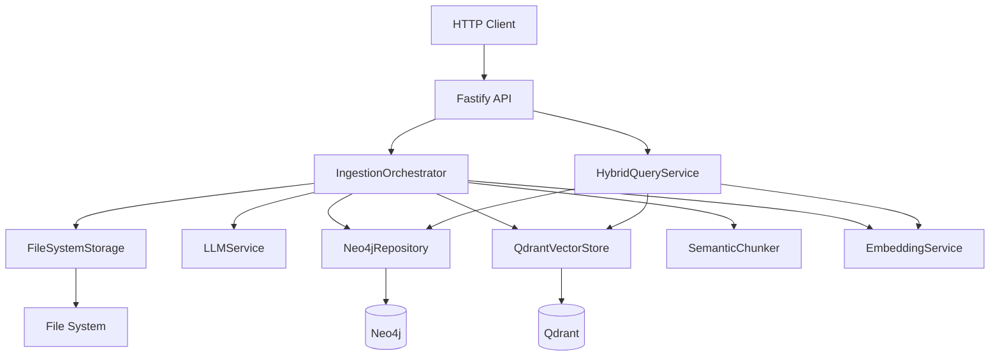

# Keystone Audit Knowledge Graph v0

Backend service that ingests audit documents (FMEA, IPAR), extracts structured knowledge via LLM, and stores in a graph database (Neo4j) as the single source of truth, with a vector database (Qdrant) for semantic retrieval.

## Architecture



**Key Principles**:
- **Graph is authoritative** - All entities/relationships in Neo4j, not embeddings
- **Vectors are disposable** - Qdrant references graph nodes via `graphNodeId`
- **Immutable entities** - Versions linked via SUPERSEDES relationships
- **Lossless ingestion** - Documents preserved, extraction traceable to source

## Quick Start

### 1. Install dependencies
```bash
bun install
```

### 2. Start databases
```bash
bun docker:up
```

Wait for services to be healthy (~30s).

### 3. Configure environment
```bash
cp .env.example .env
```

Edit `.env` and set:
- `LLM_PROVIDER=openai`, `anthropic`, or `openrouter`
- API key for chosen provider (`OPENAI_API_KEY`, `ANTHROPIC_API_KEY`, or `OPENROUTER_API_KEY`)
- `LLM_MODEL=gpt-4-turbo`, `claude-sonnet-4-5-20250929`, or any OpenRouter model

### 4. Run Neo4j migrations
```bash
bun migrate
```

### 5. Start server
```bash
bun dev
```

Server runs at `http://localhost:3003`

## Documentation

- **[Architecture](docs/ARCHITECTURE.md)** - System design, data flow, design patterns
- **[API Reference](docs/API.md)** - All endpoints with examples
- **[Domain Model](docs/DOMAIN_MODEL.md)** - Entities, relationships, versioning
- **[Development Guide](docs/DEVELOPMENT.md)** - Config, docker, testing, troubleshooting
- **[Design Patterns](docs/DESIGN_PATTERNS.md)** - Pattern guide and examples
- **[Ontology Versioning](docs/ONTOLOGY_VERSIONING.md)** - Ontology changelog

## Quick Test

```bash
# Health check
curl http://localhost:3003/health

# Ingest document
curl -X POST http://localhost:3003/ingest \
  -F "file=@FMEA_SCHUMAG.xlsx" \
  -F 'metadata={"auditId":"aud-001","processName":"Manufacturing Line A"}'
```

## Project Structure

```
src/
├── api/              # Fastify routes, handlers, schemas
├── config/           # Environment config with Zod validation
├── domain/            # Entity and relationship types
├── services/         # Business logic (graph, vector, llm, chunking, ingestion, query)
└── utils/           # Logger, errors, UUID
```

## Success Criteria

✅ Removing vector DB doesn't invalidate conclusions  
✅ All facts trace to document sections (provenance)  
✅ Relationships explainable to auditors (confidence + source)  
✅ Entity evolution fully traceable (SUPERSEDES graph)  
✅ New document types addable without refactoring

Guiding question: "Can this system explain itself to a regulator without mentioning embeddings or AI?"