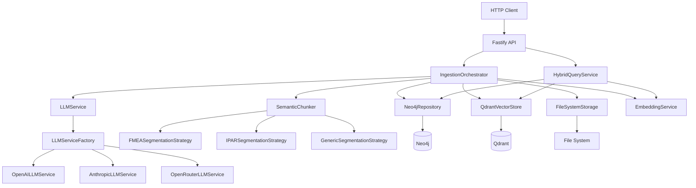
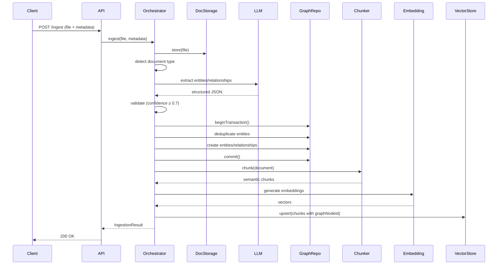
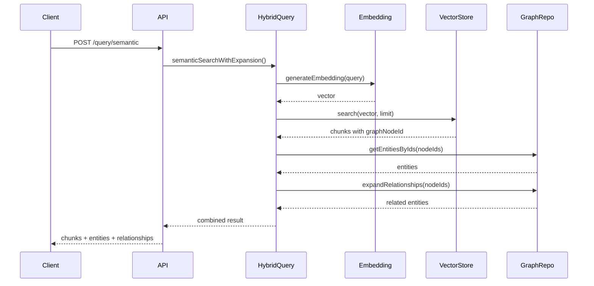

# System Architecture

## Overview

Keystone is a backend-only service that ingests audit-related documents (FMEA spreadsheets, IPAR PDFs), extracts structured audit knowledge using AI agents, and stores this knowledge in a graph database as the single source of truth, with an accompanying vector database used strictly for semantic retrieval and context lookup.

## Architecture Diagram

## Core Principles

### 1. Graph Database is Authoritative

All entities, relationships, versions, and audit conclusions live in the graph (Neo4j). The graph is the single source of truth.

**Why**: Audit conclusions must be explainable without referencing embeddings or AI behavior. Relationships are explicit, traceable, and defensible to regulators.

### 2. Vector Database is Auxiliary

Vectors store embeddings of document text chunks and always reference graph node IDs. Vectors never introduce new facts or relationships.

**Why**: Semantic similarity enables natural language queries and cross-document pattern detection, but removing the vector DB should not invalidate any audit conclusion.

### 3. AI Agents Propose, System Validates

LLMs extract candidate entities and relations; the backend validates, normalizes, and persists them. AI agents never assign IDs or persist data.

**Why**: Deterministic validation ensures correctness and traceability. AI confidence scores are stored but don't override business rules.

## Data Flow

### Ingestion Pipeline

**Key Steps**:
1. Store raw document
2. Detect type (FMEA/IPAR/generic)
3. Extract with LLM → structured JSON
4. Validate extraction (confidence, schema)
5. **Graph transaction**: Deduplicate, create entities/relationships
6. **Commit transaction** (atomic)
7. Chunk text semantically
8. Generate embeddings
9. Store vectors with `graphNodeId` references

**Rollback**: If step 5 fails, document marked FAILED, nothing persisted.

### Query Flow (Hybrid Pattern)

**Pattern**: Vectors retrieve relevant content → `graphNodeId` → Graph provides structured relationships → Combined results

## Storage Layers

### Neo4j (Graph Database)

**Purpose**: Authoritative source of truth for entities, relationships, versions.

**Stores**:
- Entities (Process, Audit, Document, FailureMode, Risk, Control, Finding, Requirement, ProcedureStep)
- Relationships (EVALUATES, USES, IDENTIFIES, IMPLIES, MITIGATES, etc.)
- Versioning (SUPERSEDES relationships)
- Provenance metadata (sourceReference, confidence, extractedBy)

**Key Features**:
- Immutable entities (versioning via SUPERSEDES)
- Business key deduplication
- Transactional consistency
- Cypher queries for complex patterns

### Qdrant (Vector Database)

**Purpose**: Semantic retrieval and context lookup.

**Stores**:
- Document chunks with embeddings (1536 dims, text-embedding-3-small)
- Metadata: `graphNodeId`, `documentId`, `semanticType`, `context`, `tokens`
- Always references graph nodes via `graphNodeId`

**Key Features**:
- HNSW index for fast similarity search
- Metadata filtering (by documentId, semanticType, etc.)
- Scroll API for batch processing
- Disposable (system works without it)

## Design Patterns

The architecture uses established patterns for extensibility:

### Strategy Pattern (Chunking)

Different segmentation algorithms for document types (FMEA, IPAR, generic). Add new document types without modifying existing code.

**Location**: `src/services/chunking/strategies/`

### Factory Pattern (LLM)

Create LLM service instances based on config (OpenAI, Anthropic, OpenRouter). Switch providers via environment variable.

**Location**: `src/services/llm/LLMServiceFactory.ts`

### Repository Pattern (Data Access)

Abstract data access behind domain-centric interfaces. Swap databases without changing business logic.

**Locations**: `src/services/graph/`, `src/services/vector/`

### Facade Pattern (Queries)

Simplify complex multi-subsystem operations (graph + vectors + embeddings). Single method call replaces 6+ coordinated operations.

**Location**: `src/services/query/HybridQueryService.ts`

### Dependency Injection (Composition)

Wire dependencies at application startup, inject via constructors. Testability (inject mocks), flexibility (swap implementations).

**Location**: `src/index.ts` (composition root)

See [Design Patterns Guide](DESIGN_PATTERNS.md) for details.

## Extensibility Model

| Need | Pattern | Files Changed | Existing Code Broken |
|------|---------|---------------|----------------------|
| New document type | Strategy | 2 (strategy file + registration) | 0 |
| New LLM provider | Factory | 2 (service file + factory case) | 0 |
| New database | Repository | 3 (interface + impl + DI) | 0 |
| New query pattern | Facade | 3 (HybridQueryService method + handler + route) | 0 |
| New service dependency | DI | 2 (service + index.ts) | 0 |

**Key**: Interfaces isolate changes. New implementations = additive, not destructive.

## System Guarantees

1. **Provenance**: Every entity traces to document section (sourceReference)
2. **Versioning**: Immutable entities, SUPERSEDES graph preserves history
3. **Explainability**: Relationships have confidence scores + source references
4. **Graceful degradation**: Qdrant failure → return graph results only
5. **Consistency**: Graph transactions ensure atomic entity creation
6. **Idempotency**: Re-ingesting same document (contentHash) returns existing ID

## Performance Characteristics

- **Ingestion**: ~4.2s for 126 chunks (extraction + graph tx + embedding + vector upsert)
- **Semantic search**: <500ms (embedding generation + Qdrant search + graph expansion)
- **Entity context**: <200ms (graph lookup + Qdrant scroll by graphNodeId)
- **Analytics**: <1s (Qdrant scrollAll 126 chunks + graph aggregations)
- **Graph pattern**: <300ms (Cypher query + optional vector context)

**Bottlenecks**: LLM extraction (3-4s), embedding generation (200-300ms for batch)

**Scaling**:
- Graph: Neo4j scales to billions of nodes/relationships
- Vectors: Qdrant HNSW index, sub-ms search at 100M+ vectors
- Chunking: Stateless, parallelizable per document

## Success Criteria

✅ Removing vector DB doesn't invalidate conclusions  
✅ All facts trace to document sections (provenance)  
✅ Relationships explainable to auditors (confidence + source)  
✅ Entity evolution fully traceable (SUPERSEDES graph)  
✅ New document types addable without refactoring

Guiding question: "Can this system explain itself to a regulator without mentioning embeddings or AI?"

